# Taskly

Guess what time it is! It's time to implement another half-way terrible idea
cooked up by your gSchool instructors. But trust them, this time it's going to
be big!

Meet Taskly, you're one stop shop for everything task related. By the time this
app's to market, you'll even be able to assign tasks to other people!
Revolutionary!

Naturally, we need this done by the end of the week; good luck!

## Setup

* `bundle`
* `rake db:create db:migrate db:seed`
* `rails server`

You can run specs with:

* `rspec`

Note: email/password combinations for existing users populated by `rake db:seed` can be found in the db/seeds.rb file.

## References

* [Rails](http://guides.rubyonrails.org/index.html)
* [Views](http://guides.rubyonrails.org/layouts_and_rendering.html)
* [Controller](http://guides.rubyonrails.org/action_controller_overview.html)
* [Model](http://guides.rubyonrails.org/active_record_basics.html)
* [ActiveRecord Querying](http://guides.rubyonrails.org/active_record_querying.html)
* [Flash](http://guides.rubyonrails.org/action_controller_overview.html#the-flash)
* [Date Select](http://api.rubyonrails.org/classes/ActionView/Helpers/DateHelper.html#method-i-date_select)
* [Validations in views](http://guides.rubyonrails.org/active_record_validations.html#displaying-validation-errors-in-views)

## Stories
**Anonymous user can view about page**
```
As an anonymous user
When I'm on the login page
And I click on "About"
Then I see the about page
```

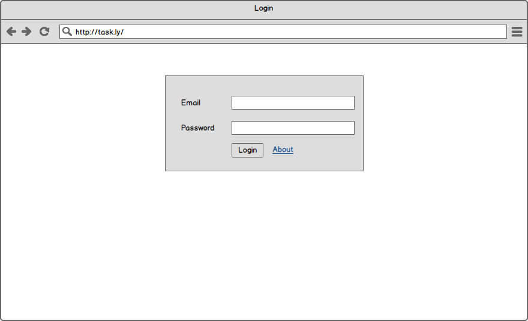
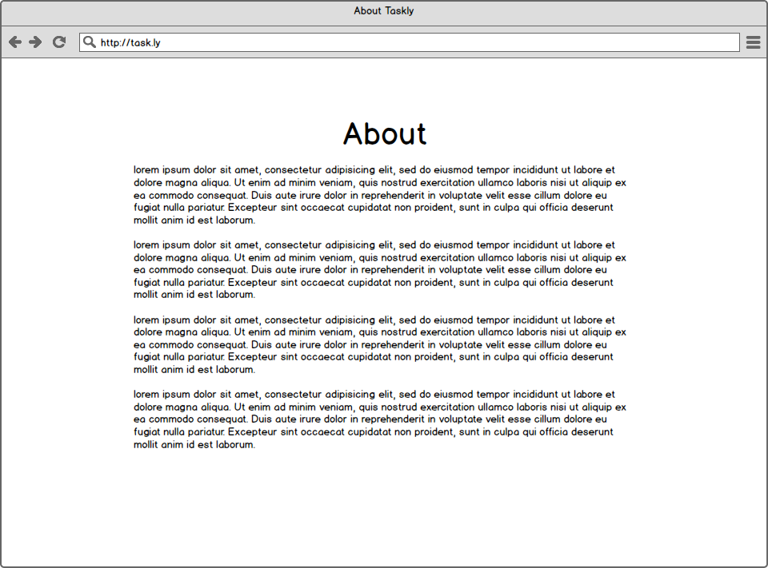

**User can add a task list**
```
As a user
When I log in I should see a "Add Task List"
When I click that link, I should see a name field
When I fill in the name and click "Create Task List"
Then I see a flash message that reads "Task List was created successfully!"
And I should see the task list title appear
```

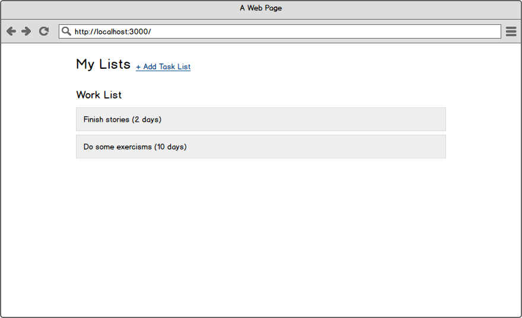
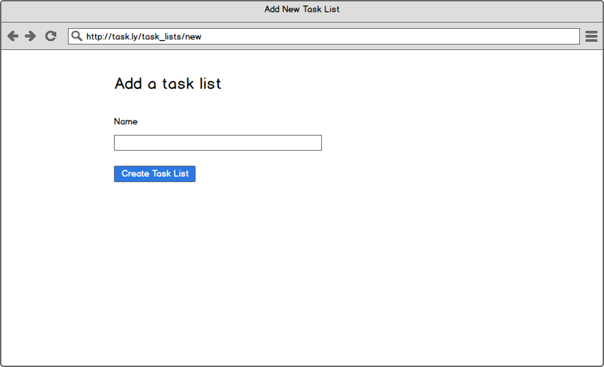


**User must fill out a title for the task list**
```
As a user
Given I'm logged in
When I am adding a task list
And I don't fill in the title field
And I press "Create Task List"
Then I should see a message that reads "Your task list could not be created" (in maroon)
```


**User can edit a task list**
```
As a user
Given I'm logged in
When I click on "Edit" next to a task list
Then I see a name field with the current name
When I fill out a different Title
And click "Update Task List"
Then I see a message that reads "Your task list was successfully updated!"
And I see the task list's new title
```

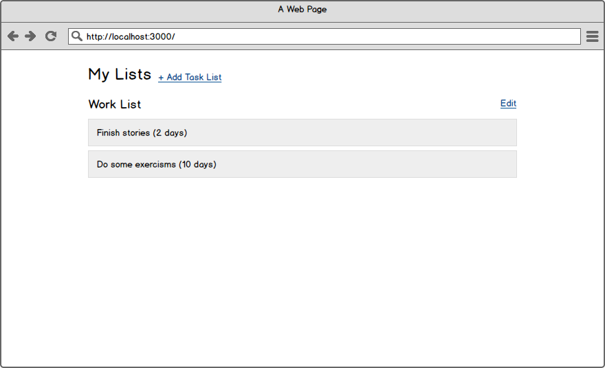
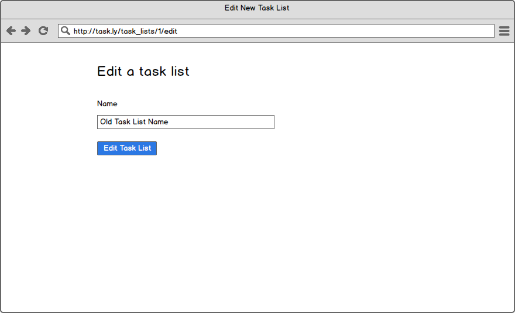
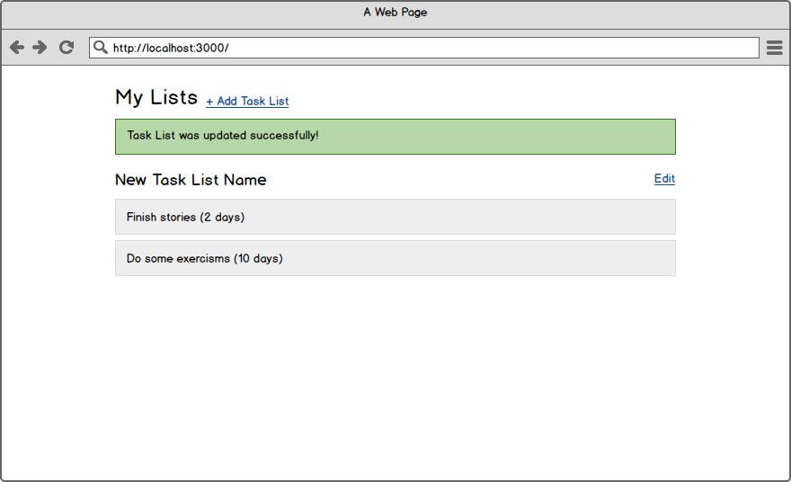

**User can add a task**
```
As a user
When I log in I should see a "new task" link next to each task list name
When I click that link, I should see a description field and a date field (w/ year / month / day dropdowns)
When I fill in a description and click "Create Task" I should see the task appear beneath the task list
And I should see a flash message that reads "Task was created successfully!"
Each task should have the due date represented in relative time
```

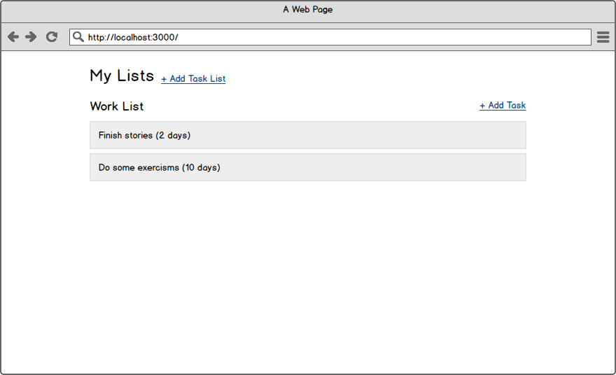
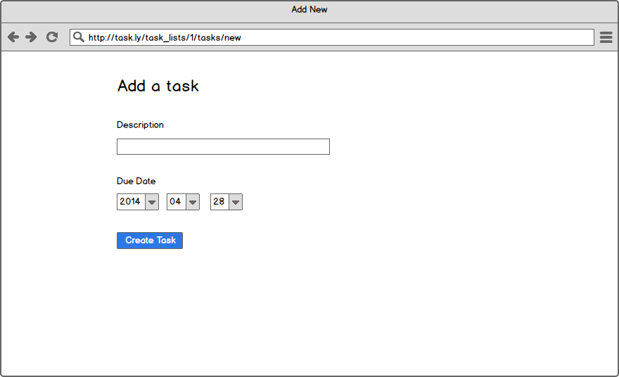
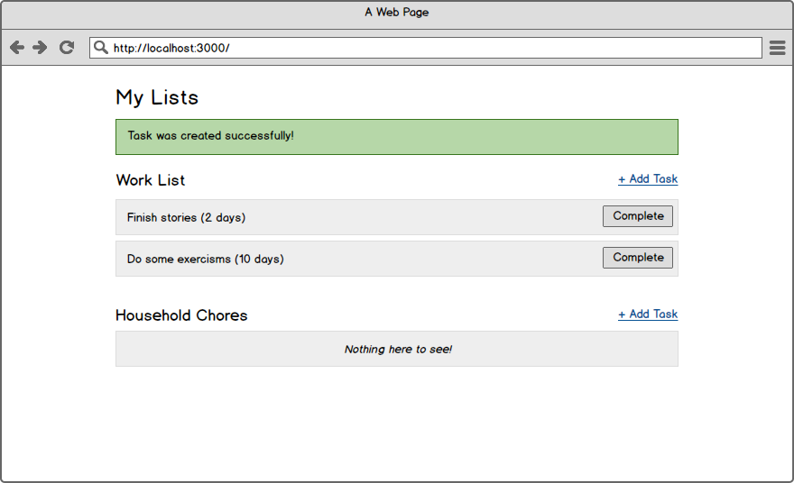

**User must fill in description on all tasks**
```
As a user
When I am adding a task
And I don't fill in the description field
And I press "Create Task"
Then I should see a message that reads "Your task could not be created" (in maroon)
And the label for the description field should be maroon.
```

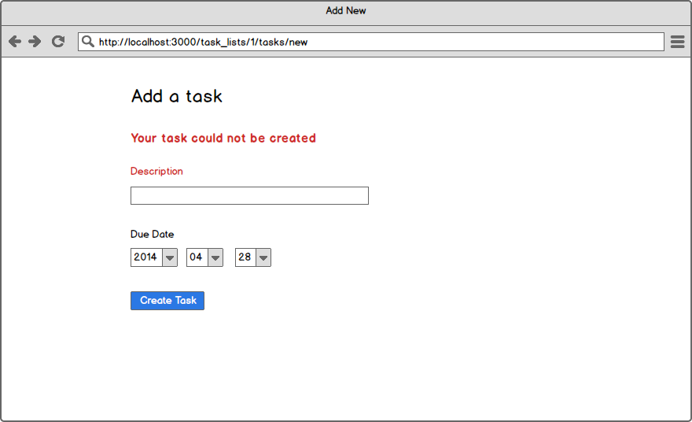

**User can delete a task**
```
As a user
Given that I'm logged in
When I click the "Delete" link next to a task
Then I see a flash message that reads "Task was deleted successfully!"
And I should no longer see that task
```

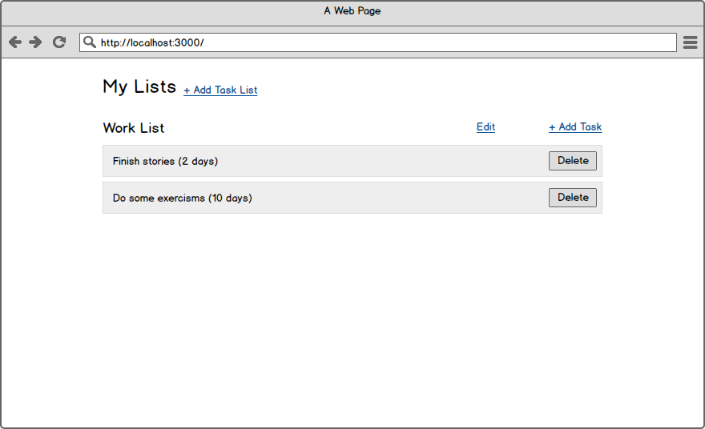

**Users can view a single task list's tasks**
```
As a user
Given that I'm logged in
When I click on the title of a task list
Then I only see the tasks for that task list
```

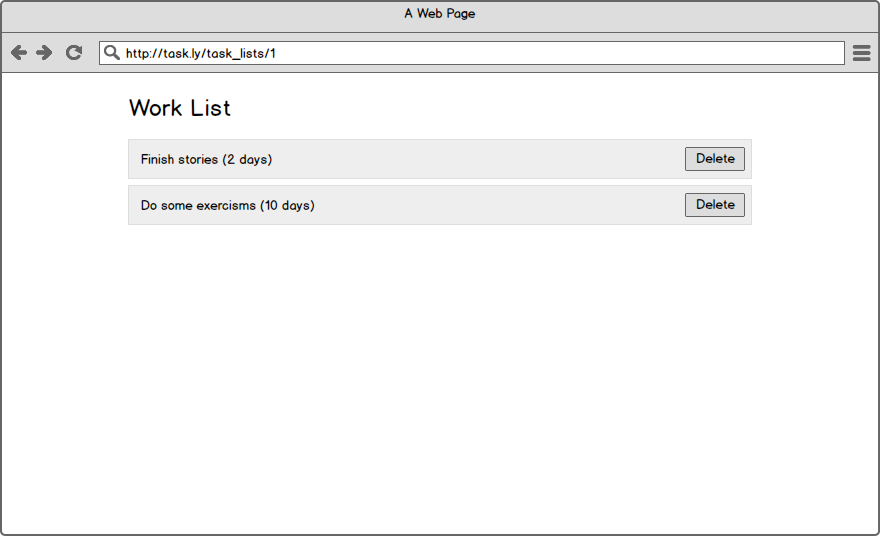

**Users can complete tasks**
```
As a user
When I go to the task lists page I should see a button to "Complete" every task
When I press that button, the task should be removed from the page
NOTE: we don't want to delete tasks from the database - just hide completed tasks from users
```

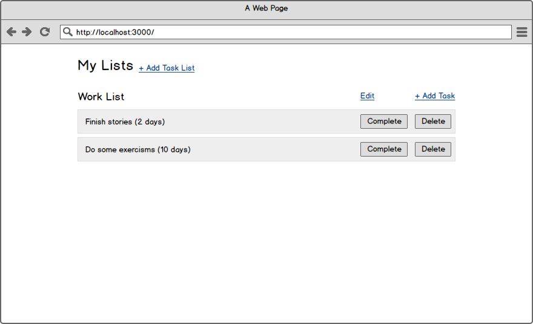

**Users can view completed tasks**
```
As a user
Given I have completed task
When I click the link "Completed" next to a task list
Then I see all completed tasks for that task list
```

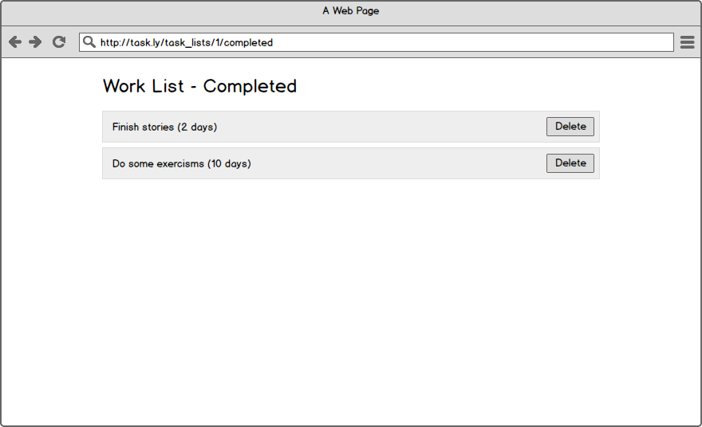
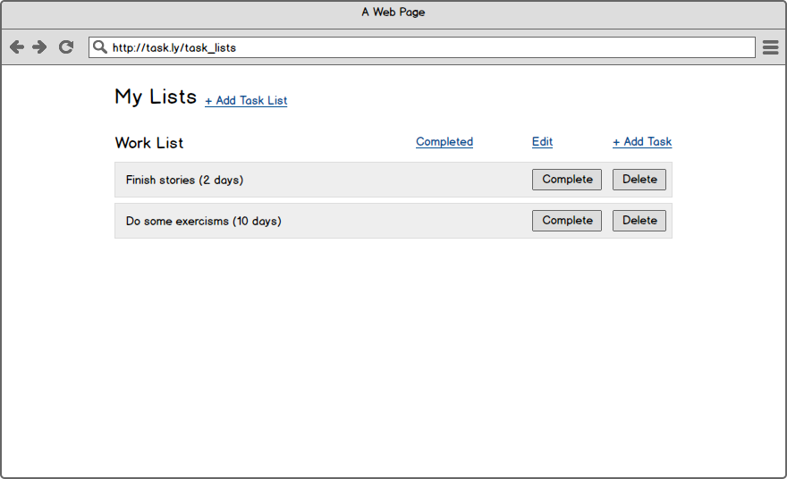


**Tasks must appear in order of their due date**
```
As a user
When I create multiple tasks in a list
Then I should see them in chronological order
```

**User can delete a task list**
```
As a user
Given that I'm logged in
When I click the "Delete" link next to a task list
Then I see a flash message that reads "Task List was deleted successfully!"
And I should no longer see that task list
And all related tasks are deleted
```

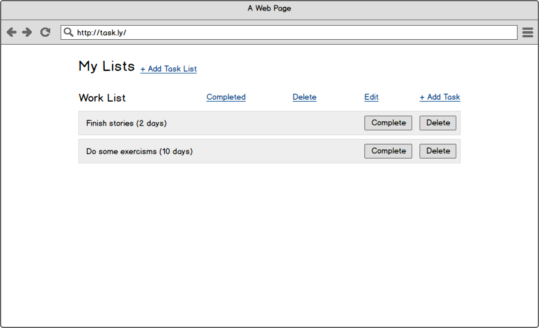

**Task lists with empty tasks should show a friendly message**
```
As a user
When I see a task list with no tasks
Then I should see a message that reads "Nothing here to see!"
```

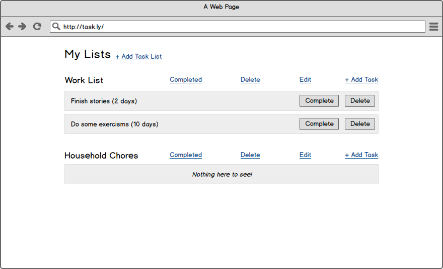

**Users should be able to assign tasks to users**
```
As a user
When I create a new task
I can optionally add a user to the task
And when a user is assigned a task, I can see that user on the index page
```

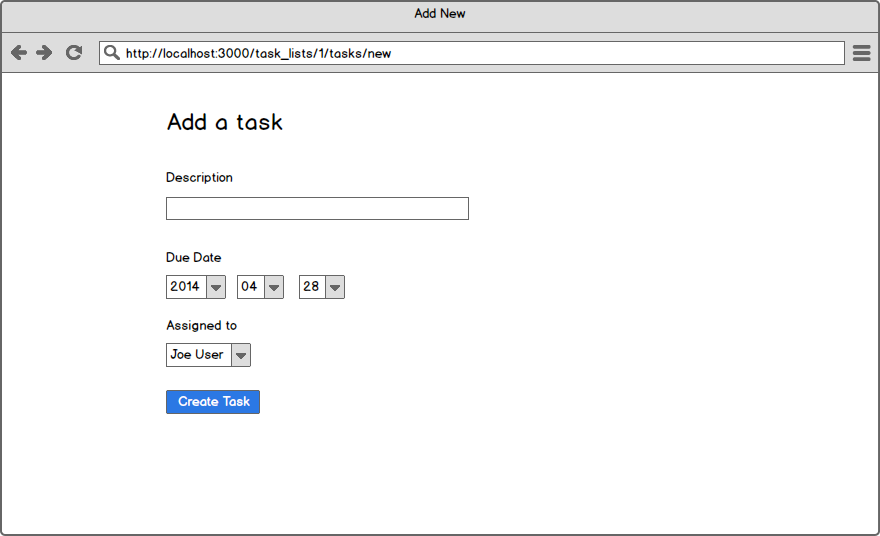
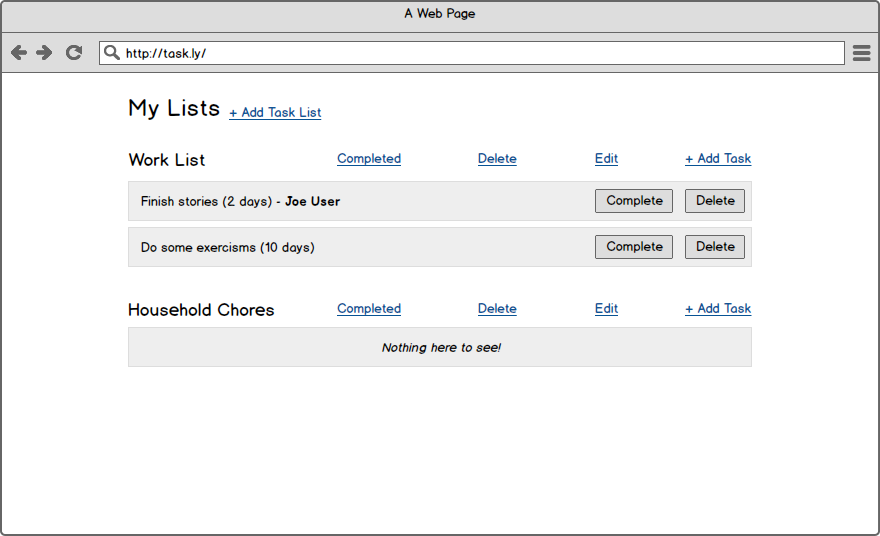

**Non-logged in users should not be able to see the new task page, or be able to create a task**
```
As a non-logged in user
When I visit the new task path for any task list
Then I should be redirected to the login page
```

